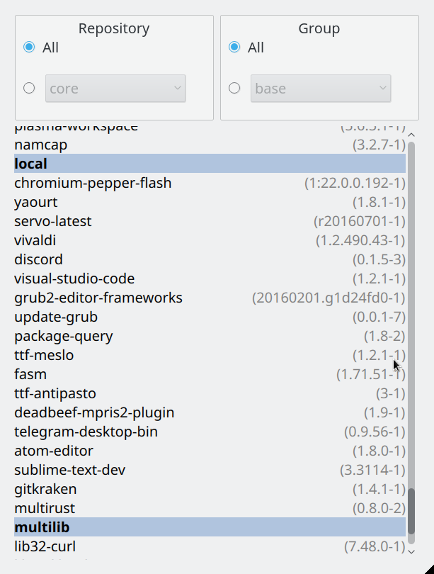

# Kefia
Kefia is a GUI package manager based on Yaourt for Arch-based distributions.  
Application is done mostly to illustrate usage of [QML bindings for Rust](https://github.com/White-Oak/qml-rust) and personal use.

# Features

Currently only:
* Lists packages grouped by repo they came from.
* View only packages in a selected group or a repository.
* Select and deselect packages to form a string to copy somewhere else, for example to `yaourt -Rns` them

To be implemented:
* Being able to perform certain actions on selected packages in kefia (e.g. delete them)
* Perform system update (`yaourt -Syua`)
* Update AUR packages (source their PKGBUILD to see if a new version is out).

# Requirements

Being able to build [QML bindings for Rust](https://github.com/White-Oak/qml-rust) (having Cmake, Qt, pkg-config, Rust) and pocessing an Arch-based distribution of Linux (since `kefia` works on top of `yaourt`) is enough.

# Usage

For installation run `cargo install kefia`.

