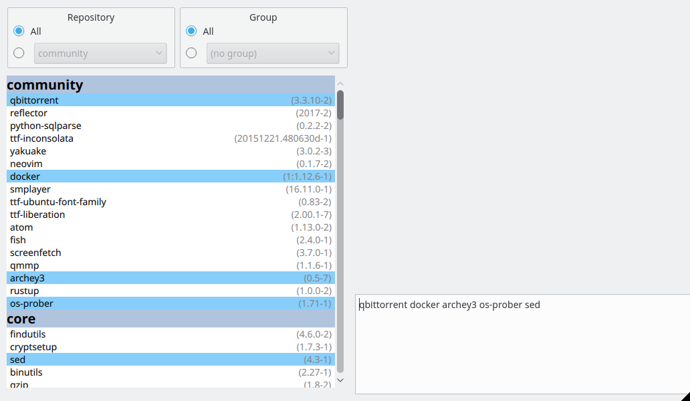

# Kefia
Kefia is a GUI package manager based on Yaourt for Arch-based distributions.  
Application is done mostly to illustrate usage of [QML bindings for Rust](https://github.com/White-Oak/qml-rust) and personal use.

# Features

Currently only:
* Lists packages grouped by repo they came from

To be implemented:
* View only packages in selected groups, repositories
* Select certain packages in a list and form a string to copy and/or perform a certain action on them (e.g. delete)
* Update AUR packages (source their PKGBUILD to see if a new version is out)

# Usage

Kefia requires Rust and Qt libraries on a system.
For installation run `cargo install kefia`.

